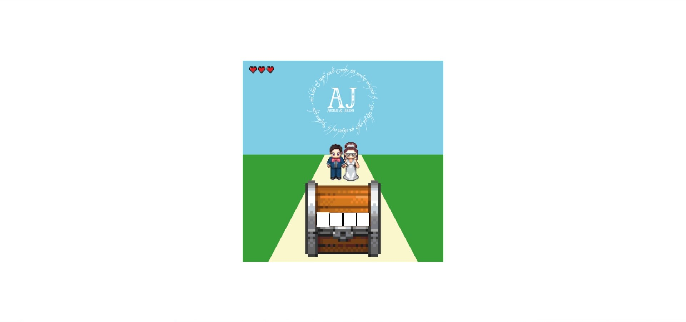
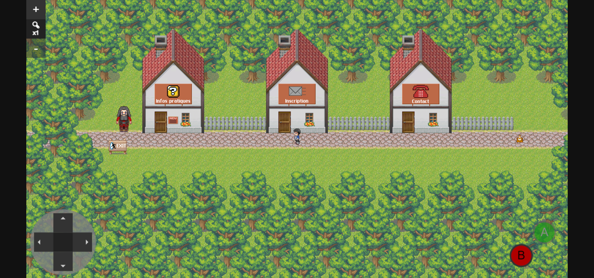
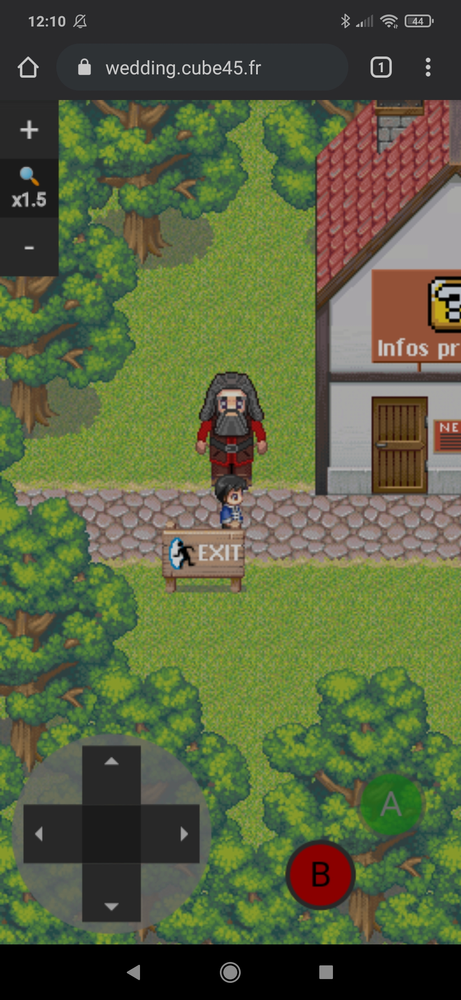
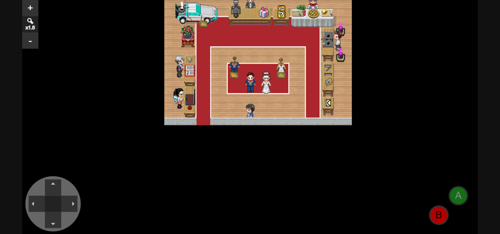
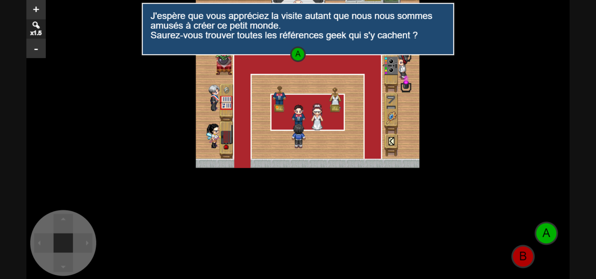
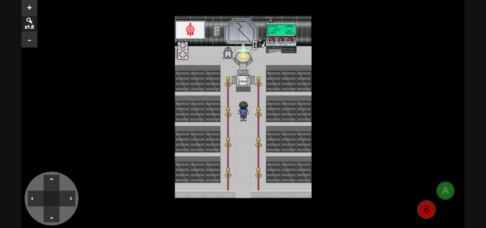
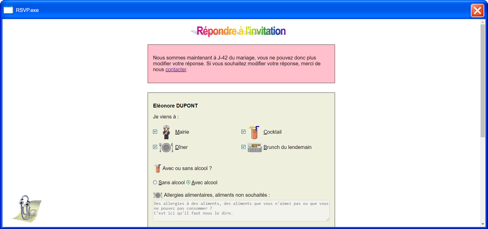
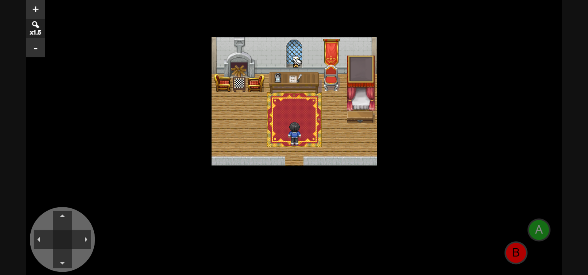
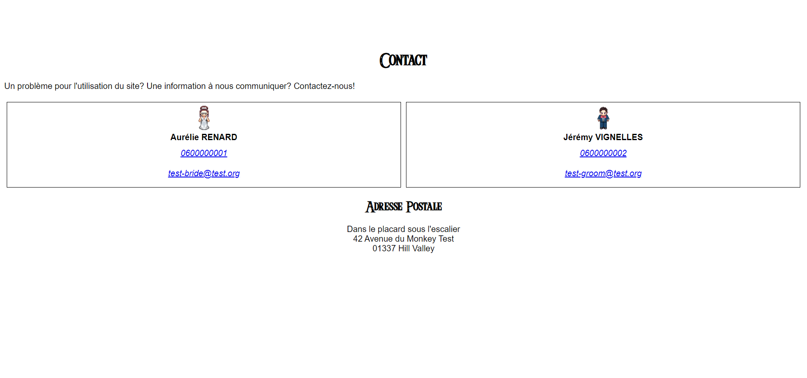

# Screenshots

  
  
  
  
  
  
  
  
  

# Wedding website

[_Version Française_](#site-de-notre-mariage)

This is the source code of our wedding website. Everything is in french, but source code is written in english as much as possible.
We made this project in less than a year, in our free time, with the following constraints:
- Create an original website that could work on phones, tablets and computers.
- Reflect the "geek" theme of the wedding
- Make the website slim and fast (i.e. limit the number of dependencies).
- Some choices were made so that we could deliver in a limited amount of time rather than thinking about maintenance costs or reusability.

## Features

- A simple "authentication" mechanism.
- A game that can be played on smartphone/tablets/computer
- Several rooms with infos about the wedding
- Replies, with food and alcohol preferences
- Administration part to see who replied what and who visited what
- Data export for printing on invites with Adobe Illustrator.
- Table placement administration and printing
- Easter eggs for our developer friends

## The stack

- ASP.net core 3.1
- Vanilla JS with Canvas API, PointerEvents and SVG
- Zing Grid for admin tables
- https://github.com/jquery/PEP (because I was using a version of Firefox for Android that didn't support pointer events at the time.)

## Acknowledgements

We needed some sprites pretty quick, so we took sprites from RPG maker XP and others we found on deviant art to remix them. However, we didn't take time to write down the sources, so we can't give them proper credit, sorry.

## License

Do what you want with the code, copy ideas etc... No help or support is given with this project, but if you're getting married and got inspired by our work, we would be glad to hear that :)

## Test it !

You can see it in action [here](https://wedding.cube45.fr). You can use the code `LM01` to log in.

The (disabled) admin panel can be found [here](https://wedding.cube45.fr/Admin) with user `root` and password `pass`.

# Site de notre mariage

Ceci est le code source du site de notre mariage.Tout est en français, mais le code source est écrit en anglais autant que possible.
Nous avons réalisé ce projet en moins d'un an, sur notre temps libre, avec les contraintes suivantes :
- Créer un site web original qui pourrait fonctionner sur téléphone, tablettes et ordinateurs.
- Coller au thème "geek" du mariage
- Rendre le site léger et rapide (c'est à dire limiter le nombre de dépendances).
- Certains choix ont été fait pour livrer dans un temps limité, plutôt que de penser au coût de la maintenance ou à la réutilisabilité.

## Fonctionnalités

- Un mécanisme d'"Authentification" simple
- Un jeu qui peut être joué sur smartphone/tablette/ordinateur
- Plusieurs salles avec des informations pratiques sur le mariage
- Réponses avec préférences alimentaires et de boissons alcoolisées
- Zone d'administration pour voir qui a répondu et qui a visité quoi
- Export des données pour impression sur les cartons d'invitation avec Adobe Illustrator.
- Administration du placement de table et possibilité d'impression
- Des Easter eggs pour nos amis développeurs

## La stack

- ASP.net core 3.1
- Vanilla JS avec Canvas API, PointerEvents et SVG
- Zing Grid pour les tableaux d'administration
- https://github.com/jquery/PEP (parce que j'utilisait une version de firefox pour Android qui ne supportait pas les pointer events à l'époque.)

## Remerciements

Nous avions besoin de sprites assez rapidement, nous avons donc pris des sprites de RPG maker XP et d'autres que nous avons trouvés sur deviant art pour les réarranger. Cependant, nous n'avons pas pris le temps de noter les sources et nous ne pouvons pas leur donner le crédit qu'ils mériteraient, désolés.

## Licence

Faites ce que vous voulez du code, copiez les idées... Aucune aide ou support est donnée avec ce projet, mais si vous vous mariez et que notre travail vous a inspiré, nous serions heureux de l'apprendre :)

## Testez-le !

Vous pouvez le voir en action [ici](https://wedding.cube45.fr). Vous pouvez utiliser le code `LM01` pour vous connecter.

Le panneau d'administration (désactivé) peut être trouvé [ici](https://wedding.cube45.fr/Admin) avec l'utilisateur `root` et le mot de passe `pass`.